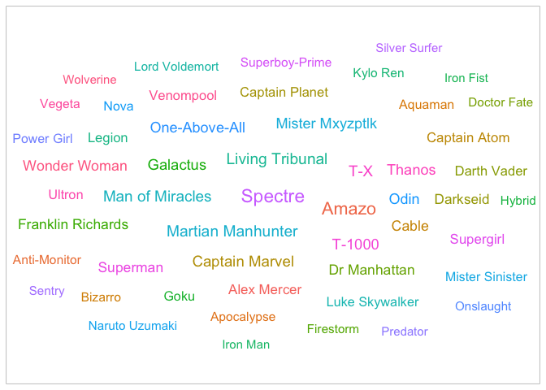

### Load the Libraries

```r
library(tidyverse)
```

```
## ── Attaching packages ─────────────────────────────────────── tidyverse 1.3.1 ──
```

```
## ✓ ggplot2 3.3.5     ✓ purrr   0.3.4
## ✓ tibble  3.1.6     ✓ dplyr   1.0.8
## ✓ tidyr   1.2.0     ✓ stringr 1.4.0
## ✓ readr   2.1.2     ✓ forcats 0.5.1
```

```
## ── Conflicts ────────────────────────────────────────── tidyverse_conflicts() ──
## x dplyr::filter() masks stats::filter()
## x dplyr::lag()    masks stats::lag()
```

```r
library(janitor)
```

```
## 
## Attaching package: 'janitor'
```

```
## The following objects are masked from 'package:stats':
## 
##     chisq.test, fisher.test
```

```r
library("palmerpenguins")

#install.packages("ggVennDiagram")
library(ggVennDiagram)
library(RColorBrewer)

#install.packages("ggworldcloud")
library(ggwordcloud)


options(scipen=999) #cancels the use of scientific notation for the session
```


### Data

```r
superhero_info <- readr::read_csv("data/heroes_information.csv", na = c("", "-99", "-"))
```

```
## Rows: 734 Columns: 10
## ── Column specification ────────────────────────────────────────────────────────
## Delimiter: ","
## chr (8): name, Gender, Eye color, Race, Hair color, Publisher, Skin color, A...
## dbl (2): Height, Weight
## 
## ℹ Use `spec()` to retrieve the full column specification for this data.
## ℹ Specify the column types or set `show_col_types = FALSE` to quiet this message.
```

```r
superhero_powers <- readr::read_csv("data/super_hero_powers.csv", na = c("", "-99", "-"))
```

```
## Rows: 667 Columns: 168
## ── Column specification ────────────────────────────────────────────────────────
## Delimiter: ","
## chr   (1): hero_names
## lgl (167): Agility, Accelerated Healing, Lantern Power Ring, Dimensional Awa...
## 
## ℹ Use `spec()` to retrieve the full column specification for this data.
## ℹ Specify the column types or set `show_col_types = FALSE` to quiet this message.
```

```r
beachbugs_long <- readr::read_csv("data/beachbugs_long.csv")
```

```
## Rows: 66 Columns: 3
## ── Column specification ────────────────────────────────────────────────────────
## Delimiter: ","
## chr (1): site
## dbl (2): year, buglevels
## 
## ℹ Use `spec()` to retrieve the full column specification for this data.
## ℹ Specify the column types or set `show_col_types = FALSE` to quiet this message.
```

### 1. 
Clean up the column names (no capitals, not spaces) of `superhero_info`, then use 2 functions to remind yourself of structure of the `superhero_info` data set.

```r
superhero_info
```

```
## # A tibble: 734 × 10
##    name      Gender `Eye color` Race  `Hair color` Height Publisher `Skin color`
##    <chr>     <chr>  <chr>       <chr> <chr>         <dbl> <chr>     <chr>       
##  1 A-Bomb    Male   yellow      Human No Hair         203 Marvel C… <NA>        
##  2 Abe Sapi… Male   blue        Icth… No Hair         191 Dark Hor… blue        
##  3 Abin Sur  Male   blue        Unga… No Hair         185 DC Comics red         
##  4 Abominat… Male   green       Huma… No Hair         203 Marvel C… <NA>        
##  5 Abraxas   Male   blue        Cosm… Black            NA Marvel C… <NA>        
##  6 Absorbin… Male   blue        Human No Hair         193 Marvel C… <NA>        
##  7 Adam Mon… Male   blue        <NA>  Blond            NA NBC - He… <NA>        
##  8 Adam Str… Male   blue        Human Blond           185 DC Comics <NA>        
##  9 Agent 13  Female blue        <NA>  Blond           173 Marvel C… <NA>        
## 10 Agent Bob Male   brown       Human Brown           178 Marvel C… <NA>        
## # … with 724 more rows, and 2 more variables: Alignment <chr>, Weight <dbl>
```


```r
superhero_info1 <- clean_names(superhero_info)
superhero_info1
```

```
## # A tibble: 734 × 10
##    name  gender eye_color race  hair_color height publisher skin_color alignment
##    <chr> <chr>  <chr>     <chr> <chr>       <dbl> <chr>     <chr>      <chr>    
##  1 A-Bo… Male   yellow    Human No Hair       203 Marvel C… <NA>       good     
##  2 Abe … Male   blue      Icth… No Hair       191 Dark Hor… blue       good     
##  3 Abin… Male   blue      Unga… No Hair       185 DC Comics red        good     
##  4 Abom… Male   green     Huma… No Hair       203 Marvel C… <NA>       bad      
##  5 Abra… Male   blue      Cosm… Black          NA Marvel C… <NA>       bad      
##  6 Abso… Male   blue      Human No Hair       193 Marvel C… <NA>       bad      
##  7 Adam… Male   blue      <NA>  Blond          NA NBC - He… <NA>       good     
##  8 Adam… Male   blue      Human Blond         185 DC Comics <NA>       good     
##  9 Agen… Female blue      <NA>  Blond         173 Marvel C… <NA>       good     
## 10 Agen… Male   brown     Human Brown         178 Marvel C… <NA>       good     
## # … with 724 more rows, and 1 more variable: weight <dbl>
```


```r
str(superhero_info1)
```

```
## spec_tbl_df [734 × 10] (S3: spec_tbl_df/tbl_df/tbl/data.frame)
##  $ name      : chr [1:734] "A-Bomb" "Abe Sapien" "Abin Sur" "Abomination" ...
##  $ gender    : chr [1:734] "Male" "Male" "Male" "Male" ...
##  $ eye_color : chr [1:734] "yellow" "blue" "blue" "green" ...
##  $ race      : chr [1:734] "Human" "Icthyo Sapien" "Ungaran" "Human / Radiation" ...
##  $ hair_color: chr [1:734] "No Hair" "No Hair" "No Hair" "No Hair" ...
##  $ height    : num [1:734] 203 191 185 203 NA 193 NA 185 173 178 ...
##  $ publisher : chr [1:734] "Marvel Comics" "Dark Horse Comics" "DC Comics" "Marvel Comics" ...
##  $ skin_color: chr [1:734] NA "blue" "red" NA ...
##  $ alignment : chr [1:734] "good" "good" "good" "bad" ...
##  $ weight    : num [1:734] 441 65 90 441 NA 122 NA 88 61 81 ...
##  - attr(*, "spec")=
##   .. cols(
##   ..   name = col_character(),
##   ..   Gender = col_character(),
##   ..   `Eye color` = col_character(),
##   ..   Race = col_character(),
##   ..   `Hair color` = col_character(),
##   ..   Height = col_double(),
##   ..   Publisher = col_character(),
##   ..   `Skin color` = col_character(),
##   ..   Alignment = col_character(),
##   ..   Weight = col_double()
##   .. )
##  - attr(*, "problems")=<externalptr>
```

```r
head(superhero_info1)
```

```
## # A tibble: 6 × 10
##   name   gender eye_color race  hair_color height publisher skin_color alignment
##   <chr>  <chr>  <chr>     <chr> <chr>       <dbl> <chr>     <chr>      <chr>    
## 1 A-Bomb Male   yellow    Human No Hair       203 Marvel C… <NA>       good     
## 2 Abe S… Male   blue      Icth… No Hair       191 Dark Hor… blue       good     
## 3 Abin … Male   blue      Unga… No Hair       185 DC Comics red        good     
## 4 Abomi… Male   green     Huma… No Hair       203 Marvel C… <NA>       bad      
## 5 Abrax… Male   blue      Cosm… Black          NA Marvel C… <NA>       bad      
## 6 Absor… Male   blue      Human No Hair       193 Marvel C… <NA>       bad      
## # … with 1 more variable: weight <dbl>
```


### 2.
Are bad guys bigger? Make box-plots of weight by `alignment` (alignment on the x-axis).

```r
superhero_info1 %>% 
  ggplot(aes(x = alignment, y = weight, fill = alignment)) +
  geom_boxplot(na.rm = TRUE)
```

<!-- -->

### 3. 
Now, make a violin plot of weight by `alignment` (alignment on the x-axis). Add some color!
  What information can you observe in the violin plot that was not visible in the boxplot?

```r
superhero_info1 %>% 
  ggplot(aes(x = alignment, y = weight, fill = alignment)) +
  geom_violin(alpha = .8, na.rm = TRUE) 
```

<!-- -->
We are able to see the distribution of weight data according to the alignments. 

### 4. 
Use `alpha = .5` in `geom_boxplot()` and `geom_violin()` to layer both plots on top of one another. What does this tell you about the distribution of weight in "`bad`" guys?

```r
superhero_info1 %>%
  ggplot(aes(x = alignment, y = weight, fill = alignment)) +
  geom_boxplot(color = "grey", alpha = .5, na.rm = TRUE) +
  geom_violin(alpha = .5, na.rm = TRUE)
```

<!-- -->
There is a large distribution in the data, i.e., it is very spread out. 

### 5. 
Box plots are great for showing how the distribution of a numeric variable (e.g. weight) varies among a categorical variable (e.g. alignment).
  Make your own violin plot with the superhero data. 
  What is your numeric data? 
  What is your categorical variable?


```r
superhero_info1 %>%
  ggplot(aes(x = gender, y = height, fill = gender)) +
  geom_boxplot(color = "grey", alpha = .5, na.rm = TRUE) +
  geom_violin(alpha = .5, na.rm = TRUE)
```

<!-- -->

### 6. 
Remind yourself what `beachbugs` looks like. Then generate a heatmap of buglevels by site and year. 
color it with `scale_fill_gradient(low="yellow", high="red")` or colors of your choice. you may find it looks best with one color!
(dont forget, `coord_flip()` is a quick way to improve the look of your plot if you dont like the default orientation)


```r
(beachbugs_long)
```

```
## # A tibble: 66 × 3
##     year site                    buglevels
##    <dbl> <chr>                       <dbl>
##  1  2013 Bondi Beach                 32.2 
##  2  2013 Bronte Beach                26.8 
##  3  2013 Clovelly Beach               9.28
##  4  2013 Coogee Beach                39.7 
##  5  2013 Gordons Bay (East)          24.8 
##  6  2013 Little Bay Beach           122.  
##  7  2013 Malabar Beach              101.  
##  8  2013 Maroubra Beach              47.1 
##  9  2013 South Maroubra Beach        39.3 
## 10  2013 South Maroubra Rockpool     96.4 
## # … with 56 more rows
```

```r
head(beachbugs_long)
```

```
## # A tibble: 6 × 3
##    year site               buglevels
##   <dbl> <chr>                  <dbl>
## 1  2013 Bondi Beach            32.2 
## 2  2013 Bronte Beach           26.8 
## 3  2013 Clovelly Beach          9.28
## 4  2013 Coogee Beach           39.7 
## 5  2013 Gordons Bay (East)     24.8 
## 6  2013 Little Bay Beach      122.
```


```r
beachbugs_long %>%
  ggplot(aes(site, year, fill= buglevels)) + 
  geom_tile() +
  scale_fill_gradient(low="blue", high="red")
```

<!-- -->

### 7.  
Use the provided code to normalize the beachbug data set. 
Then make a heatmap with the `beachbugs_normalized` data, and use the same color chois as above. Which heatmap do you think is more informative? why?


```r
#makes a new column of the highest buglevel observed at each site
beachbugs_w_max <- beachbugs_long %>% 
  group_by(site) %>% 
  mutate(max_buglevel = max(buglevels, na.rm=T)) %>% 
  arrange(site)
beachbugs_w_max
```

```
## # A tibble: 66 × 4
## # Groups:   site [11]
##     year site         buglevels max_buglevel
##    <dbl> <chr>            <dbl>        <dbl>
##  1  2013 Bondi Beach       32.2         32.2
##  2  2014 Bondi Beach       11.1         32.2
##  3  2015 Bondi Beach       14.3         32.2
##  4  2016 Bondi Beach       19.4         32.2
##  5  2017 Bondi Beach       13.2         32.2
##  6  2018 Bondi Beach       22.9         32.2
##  7  2013 Bronte Beach      26.8         61.3
##  8  2014 Bronte Beach      17.5         61.3
##  9  2015 Bronte Beach      23.6         61.3
## 10  2016 Bronte Beach      61.3         61.3
## # … with 56 more rows
```

```r
#makes a new table where the buglevels are normalized to the max_buglevel
beachbugs_normalized <- beachbugs_w_max %>% 
  group_by(site) %>% 
  mutate(norm_buglevel = buglevels/max_buglevel) %>% 
  arrange(site,year) %>%
  select(site, year, norm_buglevel)   # you dont have to select(), but I think its a clearer looking table
beachbugs_normalized
```

```
## # A tibble: 66 × 3
## # Groups:   site [11]
##    site          year norm_buglevel
##    <chr>        <dbl>         <dbl>
##  1 Bondi Beach   2013         1    
##  2 Bondi Beach   2014         0.344
##  3 Bondi Beach   2015         0.445
##  4 Bondi Beach   2016         0.601
##  5 Bondi Beach   2017         0.409
##  6 Bondi Beach   2018         0.710
##  7 Bronte Beach  2013         0.436
##  8 Bronte Beach  2014         0.285
##  9 Bronte Beach  2015         0.385
## 10 Bronte Beach  2016         1    
## # … with 56 more rows
```
 

```r
beachbugs_normalized %>%
  ggplot(aes(site, year, fill= norm_buglevel)) + 
  geom_tile() +
  scale_fill_gradient(low="blue", high="red")
```

<!-- -->
The second one is more accurate, as it gives the values in relative forms to each other, so it is much easier to compare the data. 

### 8.
Let's make a venn diagram of `superhero_info`, from 4 questions:
Is their alignment evil? 
Are their eyes red?
Are they male?
Are they bald?

Start by making the 4 vectors, then the list of vectors. The vector for alignment is provided:
### super heros venn

```r
evil_vec <- superhero_info1 %>%
  filter(alignment == "bad")%>%
  pull(name)

red_eyes_vec <- superhero_info1 %>%
  filter(eye_color == "red") %>%
  pull(name)

male_vec <- superhero_info1 %>%
  filter(gender == "Male") %>%
  pull(name)

bald_vec <- superhero_info1 %>%
  filter(hair_color == "No Hair") %>%
  pull(name)
```

Your list of vectors will look something like this:

```r
questions_list <- list(evil_vec, red_eyes_vec, male_vec, bald_vec)
```

### 9. 
Let's make the venn diagram! use the code from lab as a reference. 

```r
ggVennDiagram(questions_list, category.names = c("Evil", "Red Eyes", "Male", "Bald"))
```

<!-- -->


### 10. Choose one intersection of the venn diagram that is interesting to you. Use dplyr to find the names of the superheros in that intersection. 


```r
superhero_info1 %>%
  filter(eye_color == "red") %>% 
  filter(alignment == "bad") %>%
  filter(gender == "Male")
```

```
## # A tibble: 21 × 10
##    name  gender eye_color race  hair_color height publisher skin_color alignment
##    <chr> <chr>  <chr>     <chr> <chr>       <dbl> <chr>     <chr>      <chr>    
##  1 Amazo Male   red       Andr… <NA>          257 DC Comics <NA>       bad      
##  2 Apoc… Male   red       Muta… Black         213 Marvel C… grey       bad      
##  3 Blac… Male   red       <NA>  Black          NA Marvel C… <NA>       bad      
##  4 Blac… Male   red       Demon White         191 Marvel C… white      bad      
##  5 Dark… Male   red       New … No Hair       267 DC Comics grey       bad      
##  6 Demo… Male   red       Demon No Hair       185 Marvel C… <NA>       bad      
##  7 Doom… Male   red       Alien White         244 DC Comics <NA>       bad      
##  8 Evil… Male   red       Alien Black         191 Marvel C… green      bad      
##  9 Kill… Male   red       Meta… No Hair       244 DC Comics green      bad      
## 10 Klaw  Male   red       Human No Hair       188 Marvel C… red        bad      
## # … with 11 more rows, and 1 more variable: weight <dbl>
```


```r
superhero_info1
```

```
## # A tibble: 734 × 10
##    name  gender eye_color race  hair_color height publisher skin_color alignment
##    <chr> <chr>  <chr>     <chr> <chr>       <dbl> <chr>     <chr>      <chr>    
##  1 A-Bo… Male   yellow    Human No Hair       203 Marvel C… <NA>       good     
##  2 Abe … Male   blue      Icth… No Hair       191 Dark Hor… blue       good     
##  3 Abin… Male   blue      Unga… No Hair       185 DC Comics red        good     
##  4 Abom… Male   green     Huma… No Hair       203 Marvel C… <NA>       bad      
##  5 Abra… Male   blue      Cosm… Black          NA Marvel C… <NA>       bad      
##  6 Abso… Male   blue      Human No Hair       193 Marvel C… <NA>       bad      
##  7 Adam… Male   blue      <NA>  Blond          NA NBC - He… <NA>       good     
##  8 Adam… Male   blue      Human Blond         185 DC Comics <NA>       good     
##  9 Agen… Female blue      <NA>  Blond         173 Marvel C… <NA>       good     
## 10 Agen… Male   brown     Human Brown         178 Marvel C… <NA>       good     
## # … with 724 more rows, and 1 more variable: weight <dbl>
```


### 11. Make another venn diagram with the `superhero_info` data. What are your questions? ( At least 2!) 
How many Marvel villains are female?
How many female villains are shown with red eyes?


```r
female_vec <- superhero_info1 %>%
  filter(gender == "Female") %>%
  pull(name)

publisher_vec <- superhero_info1 %>%
  filter(publisher == "Marvel Comics") %>%
  pull(name)
```


```r
rd_questions_list <- list(female_vec, publisher_vec, red_eyes_vec, evil_vec)

ggVennDiagram(rd_questions_list, category.names = c("Female", "Marvel", "Red Eyes", "Evil"))
```

<!-- -->


### 12.
What are some very common super powers? Lets make a word cloud with the `superhero_powers` data.

Use the provided code to make the frequency table, then make a word cloud with it. 
Remember, you can change `scale_size_area(max_size = 20)` to a different number if the words wont fit!


```r
head(superhero_powers)
```

```
## # A tibble: 6 × 168
##   hero_names  Agility `Accelerated Healing` `Lantern Power Ri…` `Dimensional A…`
##   <chr>       <lgl>   <lgl>                 <lgl>               <lgl>           
## 1 3-D Man     TRUE    FALSE                 FALSE               FALSE           
## 2 A-Bomb      FALSE   TRUE                  FALSE               FALSE           
## 3 Abe Sapien  TRUE    TRUE                  FALSE               FALSE           
## 4 Abin Sur    FALSE   FALSE                 TRUE                FALSE           
## 5 Abomination FALSE   TRUE                  FALSE               FALSE           
## 6 Abraxas     FALSE   FALSE                 FALSE               TRUE            
## # … with 163 more variables: `Cold Resistance` <lgl>, Durability <lgl>,
## #   Stealth <lgl>, `Energy Absorption` <lgl>, Flight <lgl>,
## #   `Danger Sense` <lgl>, `Underwater breathing` <lgl>, Marksmanship <lgl>,
## #   `Weapons Master` <lgl>, `Power Augmentation` <lgl>,
## #   `Animal Attributes` <lgl>, Longevity <lgl>, Intelligence <lgl>,
## #   `Super Strength` <lgl>, Cryokinesis <lgl>, Telepathy <lgl>,
## #   `Energy Armor` <lgl>, `Energy Blasts` <lgl>, Duplication <lgl>, …
```


```r
power_frequency <- superhero_powers %>% 
  select(-hero_names) %>%
  summarise_all(~(sum(.))) %>%
  pivot_longer(everything(), names_to = "power", values_to = "freq")
power_frequency
```

```
## # A tibble: 167 × 2
##    power                  freq
##    <chr>                 <int>
##  1 Agility                 242
##  2 Accelerated Healing     178
##  3 Lantern Power Ring       11
##  4 Dimensional Awareness    25
##  5 Cold Resistance          47
##  6 Durability              257
##  7 Stealth                 126
##  8 Energy Absorption        77
##  9 Flight                  212
## 10 Danger Sense             30
## # … with 157 more rows
```


```r
power_frequency %>% 
ggplot(aes(
  label = power, 
  color = power,
  size = freq
  )) +
  geom_text_wordcloud() +
  scale_size_area(max_size = 7) +
  theme_light()
```

<!-- -->
### 13.  
Who are some very powerful supers? 
 Lets make a different word cloud with the `superhero_powers` data. 
Use the provided code to make the frequency table, then make a word cloud with it.
You can use `hero_names` for the labels, and `sum_powers` for size. 


```r
power_quantity <- superhero_powers %>% 
  pivot_longer(-hero_names, names_to = "power", values_to = "yes_or_no") %>% 
  group_by(hero_names) %>% 
  mutate(sum_powers = sum(yes_or_no, na.rm=T)) %>%
  arrange(desc(sum_powers), hero_names, desc(yes_or_no))
power_quantity
```

```
## # A tibble: 111,389 × 4
## # Groups:   hero_names [667]
##    hero_names power                 yes_or_no sum_powers
##    <chr>      <chr>                 <lgl>          <int>
##  1 Spectre    Agility               TRUE              49
##  2 Spectre    Accelerated Healing   TRUE              49
##  3 Spectre    Dimensional Awareness TRUE              49
##  4 Spectre    Stealth               TRUE              49
##  5 Spectre    Energy Absorption     TRUE              49
##  6 Spectre    Flight                TRUE              49
##  7 Spectre    Marksmanship          TRUE              49
##  8 Spectre    Longevity             TRUE              49
##  9 Spectre    Intelligence          TRUE              49
## 10 Spectre    Super Strength        TRUE              49
## # … with 111,379 more rows
```

```r
#we have to trim down to only the top 50, or it will crowd the image!
power_quantity <- power_quantity %>% 
  ungroup %>%
  distinct(hero_names, sum_powers) %>%
  slice_max(sum_powers, n = 50)
power_quantity
```

```
## # A tibble: 51 × 2
##    hero_names        sum_powers
##    <chr>                  <int>
##  1 Spectre                   49
##  2 Amazo                     44
##  3 Living Tribunal           35
##  4 Martian Manhunter         35
##  5 Man of Miracles           34
##  6 Captain Marvel            33
##  7 T-X                       33
##  8 Galactus                  32
##  9 T-1000                    32
## 10 Mister Mxyzptlk           31
## # … with 41 more rows
```


```r
power_quantity %>% 
ggplot(aes(
  label = hero_names, 
  color = hero_names,
  size = sum_powers
  )) +
  geom_text_wordcloud() +
  scale_size_area(max_size = 6) +
  theme_light()
```

<!-- -->

## That's it! 🎉
Thanks for coding with us all winter! 
Now go finish your group project :) 

