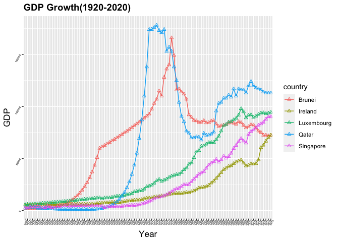

```r
getwd()
```

```
## [1] "/Users/rajesvismac/Desktop/BIS15/midterm2"
```


## Instructions
Answer the following questions and complete the exercises in RMarkdown. Please embed all of your code and push your final work to your repository. Your code should be organized, clean, and run free from errors. Be sure to **add your name** to the author header above. You may use any resources to answer these questions (including each other), but you may not post questions to Open Stacks or external help sites. There are 10 total questions.  

Make sure to use the formatting conventions of RMarkdown to make your report neat and clean! Your plots should use consistent aesthetics throughout.  

This exam is due by **12:00p on Tuesday, February 22**.  


```r
library(tidyverse)
library(naniar)
library(janitor)
library(here)
library(ggplot2)
library(dplyr)
```


## Gapminder
For this assignment, we are going to use data from  [gapminder](https://www.gapminder.org/). Gapminder includes information about economics, population, social issues, and life expectancy from countries all over the world. We will use three data sets, so please load all three as separate objects.    

1. population_total.csv  
2. income_per_person_gdppercapita_ppp_inflation_adjusted.csv  
3. life_expectancy_years.csv  


```r
populations <- read_csv("data/population_total.csv")
```

```
## Rows: 195 Columns: 302
```

```
## ── Column specification ────────────────────────────────────────────────────────
## Delimiter: ","
## chr   (1): country
## dbl (301): 1800, 1801, 1802, 1803, 1804, 1805, 1806, 1807, 1808, 1809, 1810,...
```

```
## 
## ℹ Use `spec()` to retrieve the full column specification for this data.
## ℹ Specify the column types or set `show_col_types = FALSE` to quiet this message.
```


```r
head(populations)
```

```
## # A tibble: 6 × 302
##   country  `1800` `1801` `1802` `1803` `1804` `1805` `1806` `1807` `1808` `1809`
##   <chr>     <dbl>  <dbl>  <dbl>  <dbl>  <dbl>  <dbl>  <dbl>  <dbl>  <dbl>  <dbl>
## 1 Afghani… 3.28e6 3.28e6 3.28e6 3.28e6 3.28e6 3.28e6 3.28e6 3.28e6 3.28e6 3.28e6
## 2 Albania  4   e5 4.02e5 4.04e5 4.05e5 4.07e5 4.09e5 4.11e5 4.13e5 4.14e5 4.16e5
## 3 Algeria  2.5 e6 2.51e6 2.52e6 2.53e6 2.54e6 2.55e6 2.56e6 2.56e6 2.57e6 2.58e6
## 4 Andorra  2.65e3 2.65e3 2.65e3 2.65e3 2.65e3 2.65e3 2.65e3 2.65e3 2.65e3 2.65e3
## 5 Angola   1.57e6 1.57e6 1.57e6 1.57e6 1.57e6 1.57e6 1.57e6 1.57e6 1.57e6 1.57e6
## 6 Antigua… 3.7 e4 3.7 e4 3.7 e4 3.7 e4 3.7 e4 3.7 e4 3.7 e4 3.7 e4 3.7 e4 3.7 e4
## # … with 291 more variables: 1810 <dbl>, 1811 <dbl>, 1812 <dbl>, 1813 <dbl>,
## #   1814 <dbl>, 1815 <dbl>, 1816 <dbl>, 1817 <dbl>, 1818 <dbl>, 1819 <dbl>,
## #   1820 <dbl>, 1821 <dbl>, 1822 <dbl>, 1823 <dbl>, 1824 <dbl>, 1825 <dbl>,
## #   1826 <dbl>, 1827 <dbl>, 1828 <dbl>, 1829 <dbl>, 1830 <dbl>, 1831 <dbl>,
## #   1832 <dbl>, 1833 <dbl>, 1834 <dbl>, 1835 <dbl>, 1836 <dbl>, 1837 <dbl>,
## #   1838 <dbl>, 1839 <dbl>, 1840 <dbl>, 1841 <dbl>, 1842 <dbl>, 1843 <dbl>,
## #   1844 <dbl>, 1845 <dbl>, 1846 <dbl>, 1847 <dbl>, 1848 <dbl>, 1849 <dbl>, …
```


```r
incomes <- read_csv("data/income_per_person_gdppercapita_ppp_inflation_adjusted.csv")
```

```
## Rows: 193 Columns: 242
```

```
## ── Column specification ────────────────────────────────────────────────────────
## Delimiter: ","
## chr   (1): country
## dbl (241): 1800, 1801, 1802, 1803, 1804, 1805, 1806, 1807, 1808, 1809, 1810,...
```

```
## 
## ℹ Use `spec()` to retrieve the full column specification for this data.
## ℹ Specify the column types or set `show_col_types = FALSE` to quiet this message.
```


```r
head(incomes)
```

```
## # A tibble: 6 × 242
##   country  `1800` `1801` `1802` `1803` `1804` `1805` `1806` `1807` `1808` `1809`
##   <chr>     <dbl>  <dbl>  <dbl>  <dbl>  <dbl>  <dbl>  <dbl>  <dbl>  <dbl>  <dbl>
## 1 Afghani…    603    603    603    603    603    603    603    603    603    603
## 2 Albania     667    667    667    667    667    668    668    668    668    668
## 3 Algeria     715    716    717    718    719    720    721    722    723    724
## 4 Andorra    1200   1200   1200   1200   1210   1210   1210   1210   1220   1220
## 5 Angola      618    620    623    626    628    631    634    637    640    642
## 6 Antigua…    757    757    757    757    757    757    757    758    758    758
## # … with 231 more variables: 1810 <dbl>, 1811 <dbl>, 1812 <dbl>, 1813 <dbl>,
## #   1814 <dbl>, 1815 <dbl>, 1816 <dbl>, 1817 <dbl>, 1818 <dbl>, 1819 <dbl>,
## #   1820 <dbl>, 1821 <dbl>, 1822 <dbl>, 1823 <dbl>, 1824 <dbl>, 1825 <dbl>,
## #   1826 <dbl>, 1827 <dbl>, 1828 <dbl>, 1829 <dbl>, 1830 <dbl>, 1831 <dbl>,
## #   1832 <dbl>, 1833 <dbl>, 1834 <dbl>, 1835 <dbl>, 1836 <dbl>, 1837 <dbl>,
## #   1838 <dbl>, 1839 <dbl>, 1840 <dbl>, 1841 <dbl>, 1842 <dbl>, 1843 <dbl>,
## #   1844 <dbl>, 1845 <dbl>, 1846 <dbl>, 1847 <dbl>, 1848 <dbl>, 1849 <dbl>, …
```


```r
life_expectancy <- read_csv("data/life_expectancy_years.csv")
```

```
## Rows: 187 Columns: 302
```

```
## ── Column specification ────────────────────────────────────────────────────────
## Delimiter: ","
## chr   (1): country
## dbl (301): 1800, 1801, 1802, 1803, 1804, 1805, 1806, 1807, 1808, 1809, 1810,...
```

```
## 
## ℹ Use `spec()` to retrieve the full column specification for this data.
## ℹ Specify the column types or set `show_col_types = FALSE` to quiet this message.
```


```r
head(life_expectancy)
```

```
## # A tibble: 6 × 302
##   country  `1800` `1801` `1802` `1803` `1804` `1805` `1806` `1807` `1808` `1809`
##   <chr>     <dbl>  <dbl>  <dbl>  <dbl>  <dbl>  <dbl>  <dbl>  <dbl>  <dbl>  <dbl>
## 1 Afghani…   28.2   28.2   28.2   28.2   28.2   28.2   28.1   28.1   28.1   28.1
## 2 Albania    35.4   35.4   35.4   35.4   35.4   35.4   35.4   35.4   35.4   35.4
## 3 Algeria    28.8   28.8   28.8   28.8   28.8   28.8   28.8   28.8   28.8   28.8
## 4 Andorra    NA     NA     NA     NA     NA     NA     NA     NA     NA     NA  
## 5 Angola     27     27     27     27     27     27     27     27     27     27  
## 6 Antigua…   33.5   33.5   33.5   33.5   33.5   33.5   33.5   33.5   33.5   33.5
## # … with 291 more variables: 1810 <dbl>, 1811 <dbl>, 1812 <dbl>, 1813 <dbl>,
## #   1814 <dbl>, 1815 <dbl>, 1816 <dbl>, 1817 <dbl>, 1818 <dbl>, 1819 <dbl>,
## #   1820 <dbl>, 1821 <dbl>, 1822 <dbl>, 1823 <dbl>, 1824 <dbl>, 1825 <dbl>,
## #   1826 <dbl>, 1827 <dbl>, 1828 <dbl>, 1829 <dbl>, 1830 <dbl>, 1831 <dbl>,
## #   1832 <dbl>, 1833 <dbl>, 1834 <dbl>, 1835 <dbl>, 1836 <dbl>, 1837 <dbl>,
## #   1838 <dbl>, 1839 <dbl>, 1840 <dbl>, 1841 <dbl>, 1842 <dbl>, 1843 <dbl>,
## #   1844 <dbl>, 1845 <dbl>, 1846 <dbl>, 1847 <dbl>, 1848 <dbl>, 1849 <dbl>, …
```

1. (3 points) Once you have an idea of the structure of the data, please make each data set tidy (hint: think back to pivots) and store them as new objects. You will need both the original (wide) and tidy (long) data! 

```r
populations_tidy <- 
  populations %>% 
  pivot_longer(-country, 
               names_to = "year",
               values_to = "pop.",
               values_drop_na = TRUE
               )
populations_tidy
```

```
## # A tibble: 58,695 × 3
##    country     year     pop.
##    <chr>       <chr>   <dbl>
##  1 Afghanistan 1800  3280000
##  2 Afghanistan 1801  3280000
##  3 Afghanistan 1802  3280000
##  4 Afghanistan 1803  3280000
##  5 Afghanistan 1804  3280000
##  6 Afghanistan 1805  3280000
##  7 Afghanistan 1806  3280000
##  8 Afghanistan 1807  3280000
##  9 Afghanistan 1808  3280000
## 10 Afghanistan 1809  3280000
## # … with 58,685 more rows
```


```r
incomes_tidy <- 
  incomes %>% 
  pivot_longer(-country, 
               names_to = "year",
               values_to = "incomes",
               values_drop_na = TRUE
               )
incomes_tidy
```

```
## # A tibble: 46,513 × 3
##    country     year  incomes
##    <chr>       <chr>   <dbl>
##  1 Afghanistan 1800      603
##  2 Afghanistan 1801      603
##  3 Afghanistan 1802      603
##  4 Afghanistan 1803      603
##  5 Afghanistan 1804      603
##  6 Afghanistan 1805      603
##  7 Afghanistan 1806      603
##  8 Afghanistan 1807      603
##  9 Afghanistan 1808      603
## 10 Afghanistan 1809      603
## # … with 46,503 more rows
```


```r
life_expectancy_tidy <- 
  life_expectancy %>% 
  pivot_longer(-country, 
               names_to = "year",
               values_to = "age",
               values_drop_na = TRUE
               )
life_expectancy_tidy
```

```
## # A tibble: 55,528 × 3
##    country     year    age
##    <chr>       <chr> <dbl>
##  1 Afghanistan 1800   28.2
##  2 Afghanistan 1801   28.2
##  3 Afghanistan 1802   28.2
##  4 Afghanistan 1803   28.2
##  5 Afghanistan 1804   28.2
##  6 Afghanistan 1805   28.2
##  7 Afghanistan 1806   28.1
##  8 Afghanistan 1807   28.1
##  9 Afghanistan 1808   28.1
## 10 Afghanistan 1809   28.1
## # … with 55,518 more rows
```

2. (1 point) How many different countries are represented in the data? Provide the total number and their names. Since each data set includes different numbers of countries, you will need to do this for each one.  

```r
populations %>% 
  count(country, sort=T)
```

```
## # A tibble: 195 × 2
##    country                 n
##    <chr>               <int>
##  1 Afghanistan             1
##  2 Albania                 1
##  3 Algeria                 1
##  4 Andorra                 1
##  5 Angola                  1
##  6 Antigua and Barbuda     1
##  7 Argentina               1
##  8 Armenia                 1
##  9 Australia               1
## 10 Austria                 1
## # … with 185 more rows
```

```r
incomes %>% 
  count(country, sort=T)
```

```
## # A tibble: 193 × 2
##    country                 n
##    <chr>               <int>
##  1 Afghanistan             1
##  2 Albania                 1
##  3 Algeria                 1
##  4 Andorra                 1
##  5 Angola                  1
##  6 Antigua and Barbuda     1
##  7 Argentina               1
##  8 Armenia                 1
##  9 Australia               1
## 10 Austria                 1
## # … with 183 more rows
```


```r
life_expectancy %>% 
  count(country, sort=T)
```

```
## # A tibble: 187 × 2
##    country                 n
##    <chr>               <int>
##  1 Afghanistan             1
##  2 Albania                 1
##  3 Algeria                 1
##  4 Andorra                 1
##  5 Angola                  1
##  6 Antigua and Barbuda     1
##  7 Argentina               1
##  8 Armenia                 1
##  9 Australia               1
## 10 Austria                 1
## # … with 177 more rows
```

## Life Expectancy  

```r
names(life_expectancy_tidy)
```

```
## [1] "country" "year"    "age"
```


3. (2 points) Let's limit the data to 100 years (1920-2020). For these years, which country has the highest average life expectancy? How about the lowest average life expectancy? 


```r
life_expectancy_tidy2 <-
  life_expectancy_tidy %>%
  select (country, year, age)%>%
  filter (year >= "1920") %>%
  filter(year < "2021") 
life_expectancy_tidy2 
```

```
## # A tibble: 18,728 × 3
##    country     year    age
##    <chr>       <chr> <dbl>
##  1 Afghanistan 1920   30.6
##  2 Afghanistan 1921   30.7
##  3 Afghanistan 1922   30.8
##  4 Afghanistan 1923   30.8
##  5 Afghanistan 1924   30.9
##  6 Afghanistan 1925   31  
##  7 Afghanistan 1926   31  
##  8 Afghanistan 1927   31.1
##  9 Afghanistan 1928   31.1
## 10 Afghanistan 1929   31.2
## # … with 18,718 more rows
```

```r
life_expectancy_tidy2 %>% 
  group_by(country) %>% 
  summarize(mean_age=mean(age, na.rm=T))%>%
  arrange (desc(mean_age))
```

```
## # A tibble: 187 × 2
##    country     mean_age
##    <chr>          <dbl>
##  1 Andorra         79.8
##  2 Sweden          73.5
##  3 Norway          73.2
##  4 Netherlands     73.0
##  5 Dominica        73.0
##  6 Iceland         72.9
##  7 Australia       72.7
##  8 Switzerland     72.7
##  9 Denmark         71.9
## 10 Canada          71.8
## # … with 177 more rows
```

```r
life_expectancy_tidy2 %>% 
  group_by(country) %>% 
  summarize(mean_age=mean(age, na.rm=T)) %>% 
  arrange(mean_age)%>%
  ggplot(aes(x=country, y=mean_age))+ geom_col()+ coord_flip()
```

<!-- -->
4. (3 points) Although we can see which country has the highest life expectancy for the past 100 years, we don't know which countries have changed the most. What are the top 5 countries that have experienced the biggest improvement in life expectancy between 1920-2020?

```r
life_expectancy_tidyx <-
  life_expectancy_tidy %>%
  select (country, year, age)%>%
  filter (year == "1920" | year == "2020")
life_expectancy_tidyx 
```

```
## # A tibble: 368 × 3
##    country             year    age
##    <chr>               <chr> <dbl>
##  1 Afghanistan         1920   30.6
##  2 Afghanistan         2020   64.4
##  3 Albania             1920   35.4
##  4 Albania             2020   78.6
##  5 Algeria             1920   29.6
##  6 Algeria             2020   78.3
##  7 Angola              1920   30.4
##  8 Angola              2020   65.4
##  9 Antigua and Barbuda 1920   33.9
## 10 Antigua and Barbuda 2020   77.4
## # … with 358 more rows
```

```r
life_expectancy_tidyr <- life_expectancy_tidyx %>% 
  group_by(country) %>%
    mutate(life_growth = age[year == "2020"] - age[year == '1920']) %>%
  arrange(desc(life_growth)) 
life_expectancy_tidyr
```

```
## # A tibble: 368 × 4
## # Groups:   country [184]
##    country         year    age life_growth
##    <chr>           <chr> <dbl>       <dbl>
##  1 Kuwait          1920   26.6        56.8
##  2 Kuwait          2020   83.4        56.8
##  3 Kyrgyz Republic 1920   16.6        56.5
##  4 Kyrgyz Republic 2020   73.1        56.5
##  5 Turkmenistan    1920   15.2        55.3
##  6 Turkmenistan    2020   70.5        55.3
##  7 South Korea     1920   28.2        55  
##  8 South Korea     2020   83.2        55  
##  9 Tajikistan      1920   16.7        54.3
## 10 Tajikistan      2020   71          54.3
## # … with 358 more rows
```


```r
life_expectancy_highest <- life_expectancy_tidy2 %>% 
  filter(country=='Kuwait'| country=='Kyrgyz Republic' | country=='Turkmenistan'| country=='South Korea'| country=='Tajikistan')
life_expectancy_highest
```

```
## # A tibble: 505 × 3
##    country year    age
##    <chr>   <chr> <dbl>
##  1 Kuwait  1920   26.6
##  2 Kuwait  1921   26.6
##  3 Kuwait  1922   26.6
##  4 Kuwait  1923   26.6
##  5 Kuwait  1924   26.7
##  6 Kuwait  1925   26.7
##  7 Kuwait  1926   26.7
##  8 Kuwait  1927   26.7
##  9 Kuwait  1928   26.7
## 10 Kuwait  1929   26.7
## # … with 495 more rows
```

```r
life_expectancy_highest %>% 
  ggplot(aes(x=year, y=age, group=country, color=country))+
  geom_line()+
  geom_point(shape=19)+
  theme(plot.title = element_text(size = 14, face = "bold"),
        axis.text = element_text(size = 4, angle = 60, face = "bold"),
        axis.title = element_text(size = 13))+
  labs(title = "Improvement In Life Expectancy",
       x = "Year",
       y = "Life Expectancy",
       fill = "age")
```

<!-- -->

5. (3 points) Make a plot that shows the change over the past 100 years for the country with the biggest improvement in life expectancy. Be sure to add appropriate aesthetics to make the plot clean and clear. Once you have made the plot, do a little internet searching and see if you can discover what historical event may have contributed to this remarkable change.  


```r
life_expectancy_tidy4 <- 
life_expectancy_tidy2 %>%
  filter(country == "Kuwait")
life_expectancy_tidy4
```

```
## # A tibble: 101 × 3
##    country year    age
##    <chr>   <chr> <dbl>
##  1 Kuwait  1920   26.6
##  2 Kuwait  1921   26.6
##  3 Kuwait  1922   26.6
##  4 Kuwait  1923   26.6
##  5 Kuwait  1924   26.7
##  6 Kuwait  1925   26.7
##  7 Kuwait  1926   26.7
##  8 Kuwait  1927   26.7
##  9 Kuwait  1928   26.7
## 10 Kuwait  1929   26.7
## # … with 91 more rows
```


```r
life_expectancy_tidy4 %>% 
  ggplot(aes(x=year, y=age)) + geom_point(shape=9) + geom_smooth(method=lm, se=F) +
  labs(title = "Life Expectancy in Kuwait (1920-2020)",
       x = "Year",
       y = "Life Expectancy") +
  theme(plot.title = element_text(size = 14, face = "bold"),
        axis.text = element_text(size = 4, angle = 60, face = "bold"),
        axis.title = element_text(size = 13, face = "italic"))
```

```
## `geom_smooth()` using formula 'y ~ x'
```

<!-- -->
This change is probably due to the bettering of the economy. 

## Population Growth
6. (3 points) Which 5 countries have had the highest population growth over the past 100 years (1920-2020)?  

```r
populations_tidy_100 <-
  populations_tidy %>%
  select (country, year, pop.)%>%
  filter (year >= "1920") %>%
  filter(year < "2021") 
populations_tidy_100
```

```
## # A tibble: 19,695 × 3
##    country     year      pop.
##    <chr>       <chr>    <dbl>
##  1 Afghanistan 1920  10600000
##  2 Afghanistan 1921  10500000
##  3 Afghanistan 1922  10300000
##  4 Afghanistan 1923   9710000
##  5 Afghanistan 1924   9200000
##  6 Afghanistan 1925   8720000
##  7 Afghanistan 1926   8260000
##  8 Afghanistan 1927   7830000
##  9 Afghanistan 1928   7420000
## 10 Afghanistan 1929   7100000
## # … with 19,685 more rows
```


```r
populations_tidy2 <-
  populations_tidy %>%
  select (country, year, pop.)%>%
  filter (year == "1920" | year == "2020")
populations_tidy2 
```

```
## # A tibble: 390 × 3
##    country     year      pop.
##    <chr>       <chr>    <dbl>
##  1 Afghanistan 1920  10600000
##  2 Afghanistan 2020  38900000
##  3 Albania     1920    949000
##  4 Albania     2020   2880000
##  5 Algeria     1920   5750000
##  6 Algeria     2020  43900000
##  7 Andorra     1920      5820
##  8 Andorra     2020     77300
##  9 Angola      1920   2880000
## 10 Angola      2020  32900000
## # … with 380 more rows
```


```r
populations_tidy3 <- populations_tidy2 %>% 
  group_by(country) %>%
    mutate(pop_growth = pop.[year == "2020"] - pop.[year == '1920']) %>%
  arrange(desc(pop_growth)) 
populations_tidy3
```

```
## # A tibble: 390 × 4
## # Groups:   country [195]
##    country       year        pop. pop_growth
##    <chr>         <chr>      <dbl>      <dbl>
##  1 India         1920   317000000 1063000000
##  2 India         2020  1380000000 1063000000
##  3 China         1920   472000000  968000000
##  4 China         2020  1440000000  968000000
##  5 Indonesia     1920    47300000  226700000
##  6 Indonesia     2020   274000000  226700000
##  7 United States 1920   111000000  220000000
##  8 United States 2020   331000000  220000000
##  9 Pakistan      1920    21700000  199300000
## 10 Pakistan      2020   221000000  199300000
## # … with 380 more rows
```

```r
populations_high <- populations_tidy3 %>% 
  filter(country=='India'| country=='China' | country=='Indonesia'| country=='United States'| country=='Pakistan')
populations_high
```

```
## # A tibble: 10 × 4
## # Groups:   country [5]
##    country       year        pop. pop_growth
##    <chr>         <chr>      <dbl>      <dbl>
##  1 India         1920   317000000 1063000000
##  2 India         2020  1380000000 1063000000
##  3 China         1920   472000000  968000000
##  4 China         2020  1440000000  968000000
##  5 Indonesia     1920    47300000  226700000
##  6 Indonesia     2020   274000000  226700000
##  7 United States 1920   111000000  220000000
##  8 United States 2020   331000000  220000000
##  9 Pakistan      1920    21700000  199300000
## 10 Pakistan      2020   221000000  199300000
```

7. (4 points) Produce a plot that shows the 5 countries that have had the highest population growth over the past 100 years (1920-2020). Which countries appear to have had exponential growth?  


```r
populations_high %>% 
  ggplot(aes(x=year, y=pop., group=country, color=country))+
  geom_line()+
  geom_point(shape=2)+
  theme(plot.title = element_text(size = 14, face = "bold"),
        axis.text = element_text(size = 4, angle = 60, face = "bold"),
        axis.title = element_text(size = 13))+
  labs(title = "Population Growth (1920-2020)",
       x = "Year",
       y = "Population",
       fill = "age")
```

<!-- -->
China and India seem to have shown exponential growth over the past 100 years. 

## Income
The units used for income are gross domestic product per person adjusted for differences in purchasing power in international dollars.

8. (4 points) As in the previous questions, which countries have experienced the biggest growth in per person GDP. Show this as a table and then plot the changes for the top 5 countries. With a bit of research, you should be able to explain the dramatic downturns of the wealthiest economies that occurred during the 1980's.  

```r
incomes_tidy_100 <-
  incomes_tidy %>%
  select (country, year, incomes)%>%
  filter (year >= "1920") %>%
filter (year < "2020")
incomes_tidy_100
```

```
## # A tibble: 19,300 × 3
##    country     year  incomes
##    <chr>       <chr>   <dbl>
##  1 Afghanistan 1920     1490
##  2 Afghanistan 1921     1520
##  3 Afghanistan 1922     1550
##  4 Afghanistan 1923     1570
##  5 Afghanistan 1924     1600
##  6 Afghanistan 1925     1630
##  7 Afghanistan 1926     1650
##  8 Afghanistan 1927     1680
##  9 Afghanistan 1928     1710
## 10 Afghanistan 1929     1740
## # … with 19,290 more rows
```


```r
incomes_tidy2 <-
  incomes_tidy %>%
  select (country, year, incomes)%>%
  filter (year == "1920" | year == "2020")
incomes_tidy2 
```

```
## # A tibble: 386 × 3
##    country     year  incomes
##    <chr>       <chr>   <dbl>
##  1 Afghanistan 1920     1490
##  2 Afghanistan 2020     1800
##  3 Albania     1920     1530
##  4 Albania     2020    13200
##  5 Algeria     1920     2360
##  6 Algeria     2020    14000
##  7 Andorra     1920     4190
##  8 Andorra     2020    55000
##  9 Angola      1920     1250
## 10 Angola      2020     5440
## # … with 376 more rows
```


```r
incomes_tidy3 <- incomes_tidy2 %>% 
  group_by(country) %>%
    mutate(GDP_growth = incomes[year == "2020"] - incomes[year == '1920']) %>%
  arrange(desc(GDP_growth)) 
incomes_tidy3
```

```
## # A tibble: 386 × 4
## # Groups:   country [193]
##    country    year  incomes GDP_growth
##    <chr>      <chr>   <dbl>      <dbl>
##  1 Qatar      1920     2300     113700
##  2 Qatar      2020   116000     113700
##  3 Luxembourg 1920     5730      89370
##  4 Luxembourg 2020    95100      89370
##  5 Singapore  1920     2440      88060
##  6 Singapore  2020    90500      88060
##  7 Brunei     1920     2130      72970
##  8 Brunei     2020    75100      72970
##  9 Ireland    1920     5170      68930
## 10 Ireland    2020    74100      68930
## # … with 376 more rows
```

```r
incomes_high <- incomes_tidy3 %>% 
  filter(country=='Qatar'| country=='Luxembourg' | country=='Singapore'| country=='Brunei'| country=='Ireland')
incomes_high
```

```
## # A tibble: 10 × 4
## # Groups:   country [5]
##    country    year  incomes GDP_growth
##    <chr>      <chr>   <dbl>      <dbl>
##  1 Qatar      1920     2300     113700
##  2 Qatar      2020   116000     113700
##  3 Luxembourg 1920     5730      89370
##  4 Luxembourg 2020    95100      89370
##  5 Singapore  1920     2440      88060
##  6 Singapore  2020    90500      88060
##  7 Brunei     1920     2130      72970
##  8 Brunei     2020    75100      72970
##  9 Ireland    1920     5170      68930
## 10 Ireland    2020    74100      68930
```

```r
incomes_high <- incomes_tidy_100 %>% 
  filter(country=='Qatar'| country=='Luxembourg' | country=='Singapore'| country=='Brunei'| country=='Ireland')
incomes_high
```

```
## # A tibble: 500 × 3
##    country year  incomes
##    <chr>   <chr>   <dbl>
##  1 Brunei  1920     2130
##  2 Brunei  1921     2140
##  3 Brunei  1922     2150
##  4 Brunei  1923     2160
##  5 Brunei  1924     2170
##  6 Brunei  1925     2180
##  7 Brunei  1926     2190
##  8 Brunei  1927     2200
##  9 Brunei  1928     2210
## 10 Brunei  1929     2220
## # … with 490 more rows
```

```r
incomes_high %>% 
  ggplot(aes(x=year, y=incomes, group=country, color=country))+
  geom_line()+
  geom_point(shape=2)+
  theme(plot.title = element_text(size = 14, face = "bold"),
        axis.text = element_text(size = 4, angle = 60, face = "bold"),
        axis.title = element_text(size = 13))+
  labs(title = "GDP Growth(1920-2020)",
       x = "Year",
       y = "GDP",
       fill = "incomes")
```

<!-- -->
The extreme recession in the 1980s probably caused the sudden dip in the economy. 

9. (3 points) Create three new objects that restrict each data set (life expectancy, population, income) to the years 1920-2020. Hint: I suggest doing this with the long form of your data. Once this is done, merge all three data sets using the code I provide below. You may need to adjust the code depending on how you have named your objects. I called mine `life_expectancy_100`, `population_100`, and `income_100`. For some of you, learning these `joins` will be important for your project.  


```r
gapminder_join <- inner_join(life_expectancy_tidy2, populations_tidy_100, by= c("country", "year"))
gapminder_join <- inner_join(gapminder_join, incomes_tidy_100, by= c("country", "year"))
gapminder_join
```

```
## # A tibble: 18,544 × 5
##    country     year    age     pop. incomes
##    <chr>       <chr> <dbl>    <dbl>   <dbl>
##  1 Afghanistan 1920   30.6 10600000    1490
##  2 Afghanistan 1921   30.7 10500000    1520
##  3 Afghanistan 1922   30.8 10300000    1550
##  4 Afghanistan 1923   30.8  9710000    1570
##  5 Afghanistan 1924   30.9  9200000    1600
##  6 Afghanistan 1925   31    8720000    1630
##  7 Afghanistan 1926   31    8260000    1650
##  8 Afghanistan 1927   31.1  7830000    1680
##  9 Afghanistan 1928   31.1  7420000    1710
## 10 Afghanistan 1929   31.2  7100000    1740
## # … with 18,534 more rows
```

10. (4 points) Use the joined data to perform an analysis of your choice. The analysis should include a comparison between two or more of the variables `life_expectancy`, `population`, or `income.`  


```r
gapminder_join %>% 
  ggplot(aes(x = year, y = incomes, group = pop.)) +
  geom_boxplot()
```

<!-- -->


